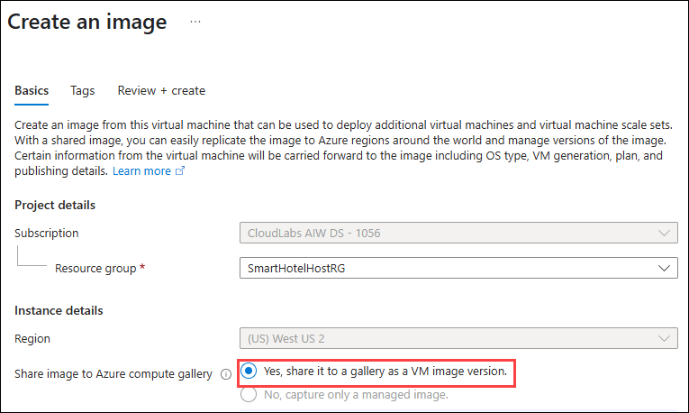
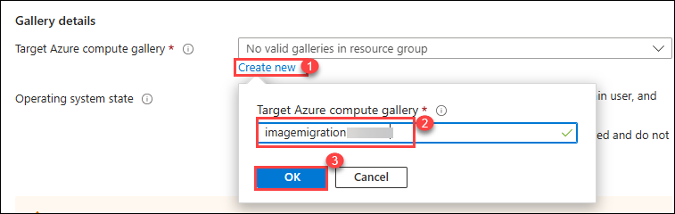
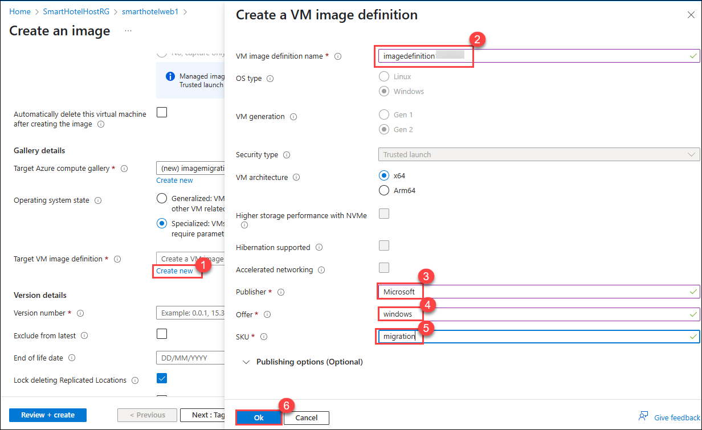
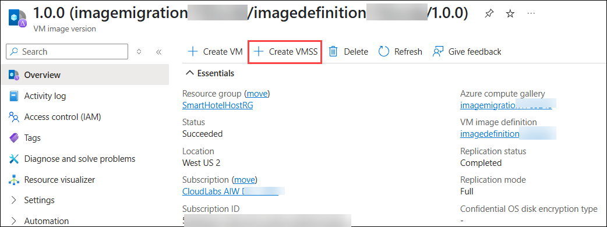
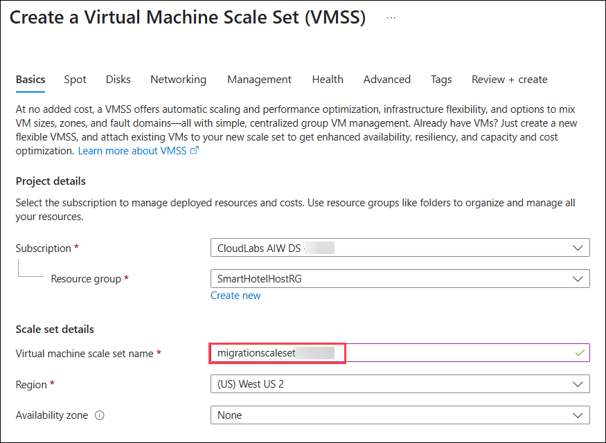
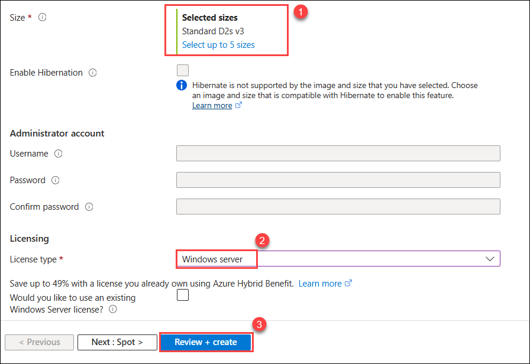
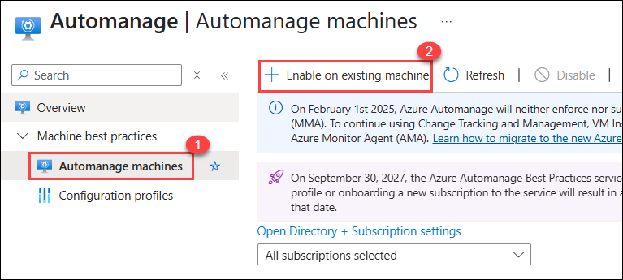

# Creating VM Scale sets from Azure VMs

### Task 1: Using VM Scale Sets to Drive Business Resiliency

1. If you are not logged in already, click on the Azure portal shortcut that is available on the desktop and log in with the below Azure credentials.
    
    * Azure Username/Email: <inject key="AzureAdUserEmail"></inject> 
    
    * Azure Password: <inject key="AzureAdUserPassword"></inject>

2. In the Azure portal's navigation pane, select **Resource groups**.

3. From the Resource groups blade, select the **SmartHotelHostRG** resource group.

4. Select **smarthotelweb1** VM to create image.

5. On the page for the VM, on the upper menu, select **Capture** and then select **Image** in the dropdown.
   
   

6. To create the image in a gallery, select **Yes, share it to a gallery as an image version** under **Instance details**.

   

7. In **Gallery details**, create a new gallery by selecting **Create new (1)** and enter **imagemigration<inject key="DeploymentID" enableCopy="false" /> (2)** and click **Ok (3)**.

   

8. In the Operating System state, select **Specialized**.

9. Select an image definition and click **Create new (1)** and create a VM Image definition by providing the following details, and then click **Ok (6)**: 
  
   - Image VM definition name: **imagedefinition<inject key="DeploymentID" enableCopy="false" /> (2)**

   - Publisher: **Microsoft (3)**
    
   - Offer: **windows (4)**
  
   - SKU: **migration (5)**

       

10. Enter an **image version** number. If this is the first version of this image, type **1.0.0**

11. Select **Review + create**.

12. After validation passes, select **Create** to create the image and wait for the image creation. Once the image is created, click on **Go to resource**. 

13. On the page for the image gallery, on the upper menu, select **+ Create VMSS**.

    

14. Under the Basics tab, enter the **Virtual Machine name scale set** name as **migrationscaleset<inject key="DeploymentID" enableCopy="false" />**

    

15. Select **Standard_D2s_v3 (1)** for the **size**.

16. Select the License type as **Windows Server (2)** and click on **Review + create (3)** and then **Create**.

     

    > **Congratulations** on completing the task! Now, it's time to validate it. Here are the steps:
    > - Click on the Validate button.
    > - If you receive a success message, you can proceed to the next task.
    > - If not, carefully read the error message and retry the step, following the instructions in the lab guide. 
    > - If you need any assistance, please contact us at labs-support@spektrasystems.com. We are available 24/7 to help you out.
    
    <validation step="3435fc35-adbc-4789-885e-d2231cc767d4" />

#### Task summary 

In this task, you have created an Image from the smarhotelweb1 virtual machine, and using that image, you successfully created a Virtual machine scale set (VMSS).

### Task 2: Azure auto manage

Azure Automanage automatically configures best practice services like backup, monitoring, and security on your virtual machines. When enabled on an existing machine, it applies these configurations without manual setup. This helps ensure compliance, operational efficiency, and reduces management overhead. In this task, you will enable Automanage on existing machines.

1. If you are not logged in already, click on the Azure portal shortcut that is available on the desktop and log in with below Azure credentials below.
    
    * Azure Username/Email: <inject key="AzureAdUserEmail"></inject> 
    
    * Azure Password: <inject key="AzureAdUserPassword"></inject>

2. In the search bar, search for and select **Automanage**.

3. From the left side panel select **Automanage machines (1)** and click on **+Enable on existing VM (2)**.
   
   

4. Under **Configuration profile**, select your profile type: **Azure Best Practices - Production or Azure Best Practices - Dev/Test, or Custom profile**.
   
   
   
   > Click **View best practice profiles** to see the differences between the environments.
    
   

5. On the **Select Machines** blade:

   a. Filter the list by your Subscription and Resource group and click on **Check eligibility on machines (1)**.
   
   b. **Check the checkbox of the virtual machine (2)** you want to onboard. (for example: let's enable automanage for smarthotelweb2.)
   
   c. Click the **Review + Create (3)** button.
   
   

6. Click **Create**.

#### Task summary 

In this task, you have successfully enabled Automanage on a virtual machine. 

### Summary

In this lab, you learned about:
 - How to create an image using an existing virtual machine
 - How to create a Virtual Machine Scale Set (VMSS) using the image
 - and how to enable Automanage on a virtual machine.

## You have successfully completed the Lab

